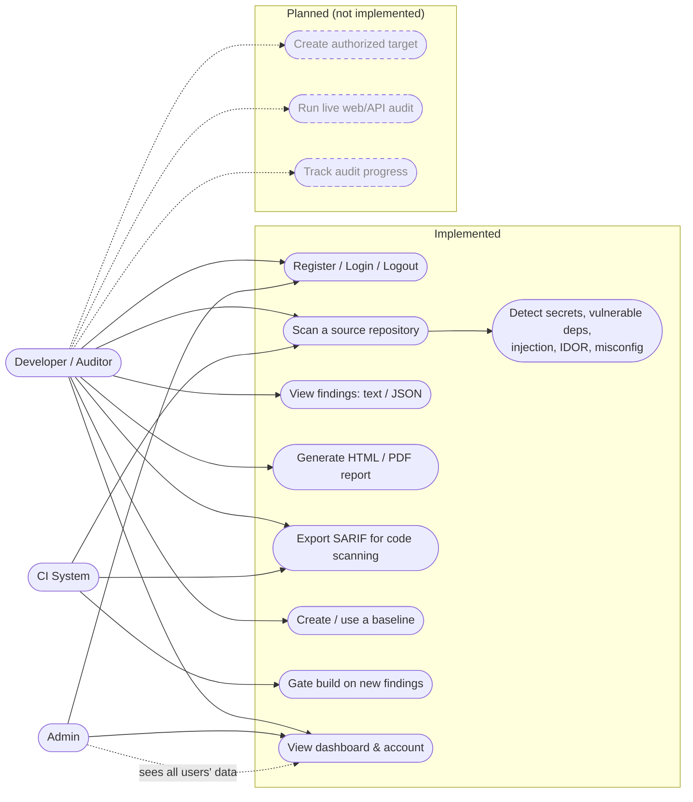

# 1. Use Case Diagram

Actors and the use cases that are **implemented today**. Planned use cases (the live
web audit) are shown dashed.

```mermaid
flowchart LR
    dev([Developer / Auditor])
    admin([Admin])
    ci([CI System])

    subgraph Implemented
        UC1([Register / Login / Logout])
        UC2([Scan a source repository])
        UC3([Detect secrets, vulnerable deps,<br/>injection, IDOR, misconfig])
        UC4([View findings: text / JSON])
        UC5([Generate HTML / PDF report])
        UC6([Export SARIF for code scanning])
        UC7([Create / use a baseline])
        UC8([Gate build on new findings])
        UC9([View dashboard & account])
    end

    subgraph "Planned (not implemented)"
        UC10([Create authorized target]):::planned
        UC11([Run live web/API audit]):::planned
        UC12([Track audit progress]):::planned
    end

    dev --> UC1 & UC2 & UC4 & UC5 & UC6 & UC7 & UC9
    dev -.-> UC10 & UC11 & UC12
    UC2 --> UC3
    ci --> UC2 & UC6 & UC8
    admin --> UC1 & UC9
    admin -. sees all users' data .-> UC9

    classDef planned stroke-dasharray: 5 5,color:#888;
```
