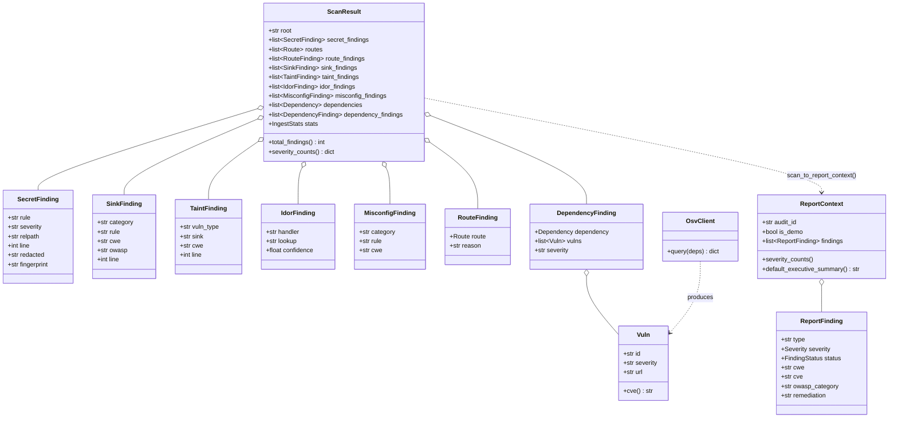
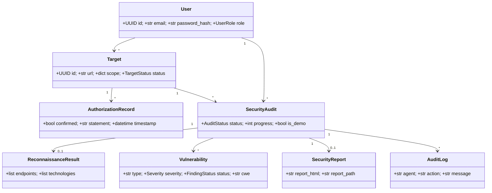

# 2. Class Diagram

The implemented static-analysis domain (`backend/app/analysis/`) and how findings
flow into the shared report model. Fields are abbreviated.

ORM models (`backend/app/models/`), used by the implemented auth API and reserved for
the planned audit pipeline:

