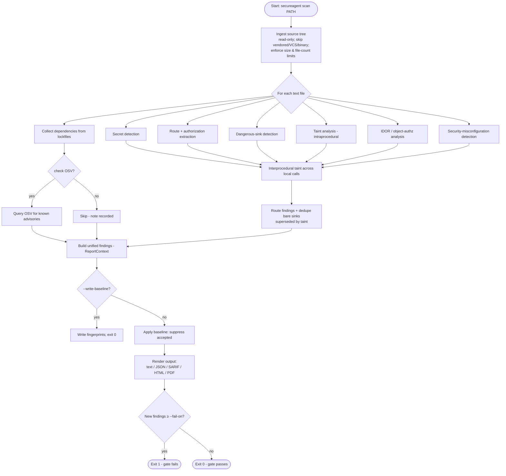

# 3. Activity Diagram — `secureagent scan`

The implemented scan pipeline, from source tree to gated output.

```mermaid
flowchart TD
    A([Start: secureagent scan PATH]) --> B[Ingest source tree<br/>read-only; skip vendored/VCS/binary;<br/>enforce size & file-count limits]
    B --> C{For each text file}
    C --> D[Secret detection]
    C --> E[Route + authorization extraction]
    C --> F[Dangerous-sink detection]
    C --> G[Taint analysis - intraprocedural]
    C --> H[IDOR / object-authz analysis]
    C --> I[Security-misconfiguration detection]
    C --> J[Collect dependencies from lockfiles]
    D & E & F & G & H & I --> K[Interprocedural taint across local calls]
    K --> L[Route findings + dedupe bare sinks<br/>superseded by taint]
    J --> M{check OSV?}
    M -- yes --> N[Query OSV for known advisories]
    M -- no --> O[Skip - note recorded]
    N & O & L --> P[Build unified findings - ReportContext]
    P --> Q{--write-baseline?}
    Q -- yes --> R[Write fingerprints; exit 0]
    Q -- no --> S[Apply baseline: suppress accepted]
    S --> T[Render output:<br/>text / JSON / SARIF / HTML / PDF]
    T --> U{New findings ≥ --fail-on?}
    U -- yes --> V([Exit 1 - gate fails])
    U -- no --> W([Exit 0 - gate passes])
```
