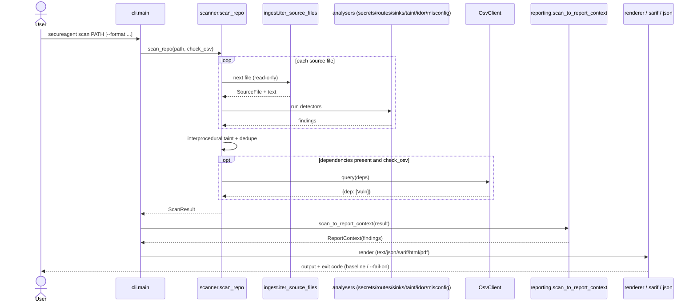
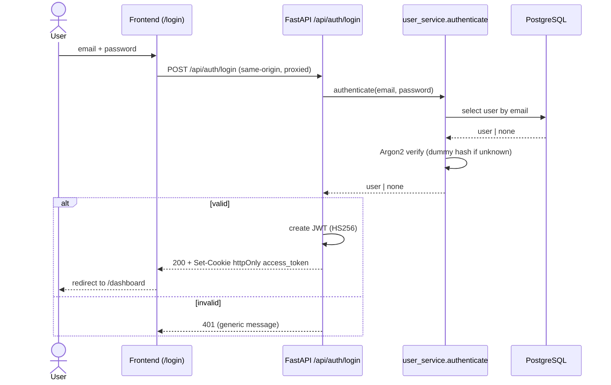

# 4. Sequence Diagrams

## 4a. `secureagent scan` (implemented)

```mermaid
sequenceDiagram
    actor User
    participant CLI as cli.main
    participant Scan as scanner.scan_repo
    participant Ing as ingest.iter_source_files
    participant An as analysers (secrets/routes/sinks/taint/idor/misconfig)
    participant OSV as OsvClient
    participant Rep as reporting.scan_to_report_context
    participant Out as renderer / sarif / json

    User->>CLI: secureagent scan PATH [--format ...]
    CLI->>Scan: scan_repo(path, check_osv)
    loop each source file
        Scan->>Ing: next file (read-only)
        Ing-->>Scan: SourceFile + text
        Scan->>An: run detectors
        An-->>Scan: findings
    end
    Scan->>Scan: interprocedural taint + dedupe
    opt dependencies present and check_osv
        Scan->>OSV: query(deps)
        OSV-->>Scan: {dep: [Vuln]}
    end
    Scan-->>CLI: ScanResult
    CLI->>Rep: scan_to_report_context(result)
    Rep-->>CLI: ReportContext(findings)
    CLI->>Out: render (text/json/sarif/html/pdf)
    Out-->>User: output + exit code (baseline / --fail-on)
```

## 4b. Authentication login (implemented)

```mermaid
sequenceDiagram
    actor User
    participant FE as Frontend (/login)
    participant API as FastAPI /api/auth/login
    participant Svc as user_service.authenticate
    participant DB as PostgreSQL

    User->>FE: email + password
    FE->>API: POST /api/auth/login (same-origin, proxied)
    API->>Svc: authenticate(email, password)
    Svc->>DB: select user by email
    DB-->>Svc: user | none
    Svc->>Svc: Argon2 verify (dummy hash if unknown)
    Svc-->>API: user | none
    alt valid
        API->>API: create JWT (HS256)
        API-->>FE: 200 + Set-Cookie httpOnly access_token
        FE-->>User: redirect to /dashboard
    else invalid
        API-->>FE: 401 (generic message)
    end
```
