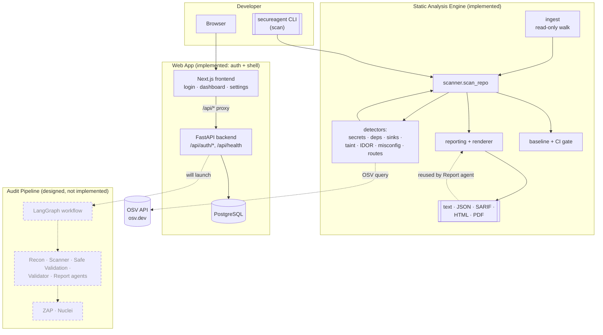

# 5. System Architecture Diagram

Solid = implemented; dashed = designed but not implemented.

```mermaid
flowchart TB
    subgraph Developer
        cli[["secureagent CLI<br/>(scan)"]]
        browser[Browser]
    end

    subgraph "Static Analysis Engine (implemented)"
        ingest[ingest<br/>read-only walk]
        detect[detectors:<br/>secrets · deps · sinks ·<br/>taint · IDOR · misconfig · routes]
        scanner[scanner.scan_repo]
        report[reporting + renderer]
        outputs[[text · JSON · SARIF ·<br/>HTML · PDF]]
        baseline[baseline + CI gate]
        ingest --> scanner --> detect --> scanner
        scanner --> report --> outputs
        scanner --> baseline
    end
    cli --> scanner
    detect -. OSV query .-> osv[(OSV API<br/>osv.dev)]

    subgraph "Web App (implemented: auth + shell)"
        fe[Next.js frontend<br/>login · dashboard · settings]
        be[FastAPI backend<br/>/api/auth/*, /api/health]
        pg[(PostgreSQL)]
        fe -->|/api/* proxy| be --> pg
    end
    browser --> fe

    subgraph "Audit Pipeline (designed, not implemented)"
        lg[LangGraph workflow]:::planned
        agents[Recon · Scanner · Safe Validation ·<br/>Validator · Report agents]:::planned
        tools[ZAP · Nuclei]:::planned
        lg -.-> agents -.-> tools
    end
    be -. will launch .-> lg
    outputs -. reused by Report agent .-> report

    classDef planned stroke-dasharray: 5 5,color:#888;
```
