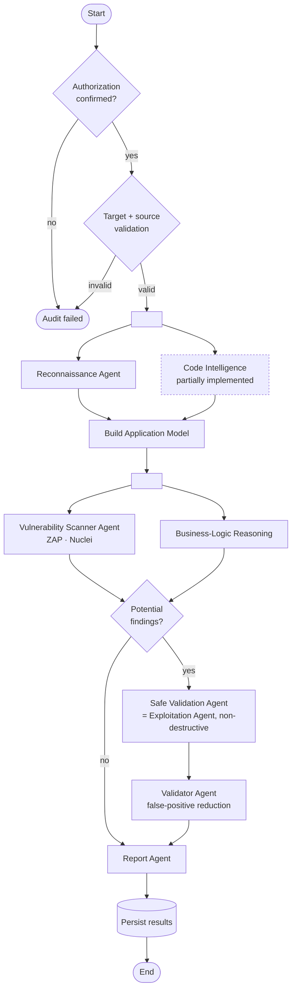

# 6. Multi-Agent Workflow Diagram (DESIGNED — not yet implemented)

> This is the academic multi-agent audit pipeline from the specification. It is
> **designed** (`docs/agent-workflow.md`, ADR-001, ADR-003) but **not implemented** —
> it depends on target management (Phases 4–5), which is not built. The PPT
> "Exploitation Agent" is realised here as the controlled, non-destructive
> **Safe Validation Agent** (ADR-003).
>
> The **Code Intelligence** stage below is partially realised today by the
> implemented static-analysis engine (secrets, taint, IDOR, misconfig, deps); the
> grey-box design (ADR-008) folds it into this pipeline.

Finding statuses produced by the Validator: `confirmed`, `likely`, `suspicious`,
`false_positive`, `informational`. The implemented static engine already uses these
same statuses honestly (definite misconfig → likely; input-dependent → suspicious;
never confirmed without dynamic/evidence).
