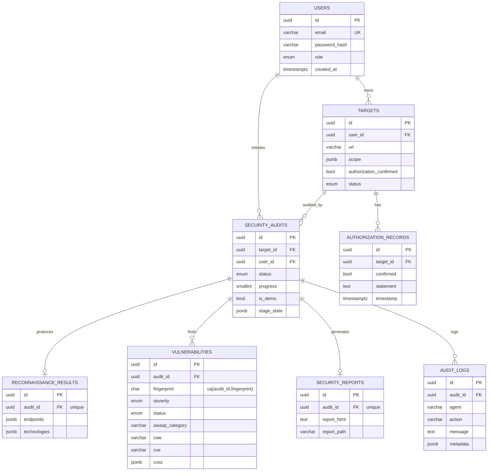

# 7. Database ER Diagram

The eight implemented tables (`backend/app/models/`, migration `afb3ff51caae`). Enum
columns are stored as `varchar` + CHECK constraints. Key attributes shown.

```mermaid
erDiagram
    USERS ||--o{ TARGETS : owns
    USERS ||--o{ SECURITY_AUDITS : initiates
    TARGETS ||--o{ AUTHORIZATION_RECORDS : has
    TARGETS ||--o{ SECURITY_AUDITS : audited_by
    SECURITY_AUDITS ||--o| RECONNAISSANCE_RESULTS : produces
    SECURITY_AUDITS ||--o{ VULNERABILITIES : finds
    SECURITY_AUDITS ||--o| SECURITY_REPORTS : generates
    SECURITY_AUDITS ||--o{ AUDIT_LOGS : logs

    USERS {
        uuid id PK
        varchar email UK
        varchar password_hash
        enum role
        timestamptz created_at
    }
    TARGETS {
        uuid id PK
        uuid user_id FK
        varchar url
        jsonb scope
        bool authorization_confirmed
        enum status
    }
    AUTHORIZATION_RECORDS {
        uuid id PK
        uuid target_id FK
        bool confirmed
        text statement
        timestamptz timestamp
    }
    SECURITY_AUDITS {
        uuid id PK
        uuid target_id FK
        uuid user_id FK
        enum status
        smallint progress
        bool is_demo
        jsonb stage_state
    }
    RECONNAISSANCE_RESULTS {
        uuid id PK
        uuid audit_id FK "unique"
        jsonb endpoints
        jsonb technologies
    }
    VULNERABILITIES {
        uuid id PK
        uuid audit_id FK
        char fingerprint "uq(audit_id,fingerprint)"
        enum severity
        enum status
        varchar owasp_category
        varchar cwe
        varchar cve
        jsonb cvss
    }
    SECURITY_REPORTS {
        uuid id PK
        uuid audit_id FK "unique"
        text report_html
        varchar report_path
    }
    AUDIT_LOGS {
        uuid id PK
        uuid audit_id FK
        varchar agent
        varchar action
        text message
        jsonb metadata
    }
```
